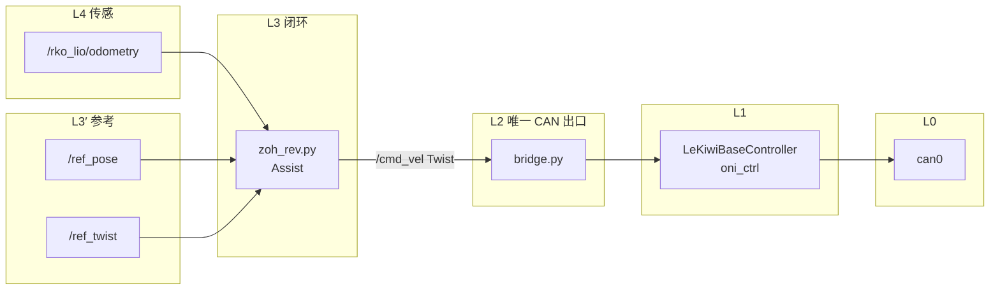
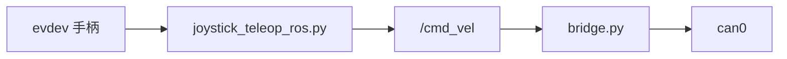
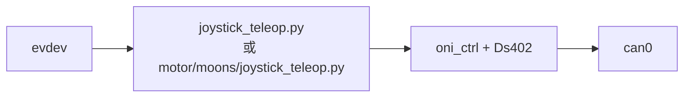

# robot_base_ctl：调用方式、数据流与分层

本文说明 **`/opt/project/robot_base_ctl`** 里底盘相关程序如何启动、话题怎么接、控制从哪一层到哪一层。**路径以仓库根 `/opt/project` 为准**；若你机器上工程目录不同，请自行替换。

---

## 1. 分层总览（谁在干什么）

| 层级 | 典型组件 | 职责 |
|------|-----------|------|
| **L0 现场总线** | SocketCAN `can0`、MDX+ 等从站 | 物理 CAN 帧 |
| **L1 CANopen / CiA402** | `joystick/Ds402_ctl.py`、`joystick/oni_ctrl.py` 中 `CanopenBus`、`MotorManager`、`LeKiwiBaseController` | NMT/SDO/PDO、SYNC、速度模式、三轮 `set_velocities_rad_s`（rad/s） |
| **L2 唯一「电机出口」推荐形态** | `motor/moons/bridge.py`（`LeKiwiBaseBridge`） | **独占 `can0`**；订阅 **`geometry_msgs/Twist`**（默认话题 **`/cmd_vel`**）；限幅后调用 `set_body_velocity(vx, vy, wz_deg)`；发布 **`/base_vel_fb`**（`TwistStamped`） |
| **L3 速度指令源（多选一或需仲裁）** | `base_ctl/zoh_rev.py`、`joystick/joystick_teleop_ros.py`、其它发 `/cmd_vel` 的节点 | 只产生 **`/cmd_vel`**，**不碰 CAN** |
| **L3′ 位姿 / 速度参考源** | `base_ctl/zoh_fb_cmd*.py`、`streaming_pose_servo_*.py` 等 | 发布 **`/ref_pose`**、可选 **`/ref_twist`** 等，供 L3 闭环用 |
| **L4 状态反馈** | 如 **`/rko_lio/odometry`**（`nav_msgs/Odometry`） | 里程计 / 滤波位姿，供闭环控制器订阅 |

**原则**：同一时刻 **只能有一个进程** 对同一组轮电机做 **CANopen 主站写 RPDO**（否则双主站冲突）。推荐 **所有底盘速度** 都进 **`bridge.py`**；手柄若走 ROS，用 **`joystick_teleop_ros.py`** 发 `/cmd_vel`，不要与 **`joystick/joystick_teleop.py`（直连 CAN）** 同时跑。

---

## 2. 数据流（示意）

### 2.1 闭环：参考位姿 / 参考速度 → `cmd_vel` → 底盘

`zoh_rev.py` 内部话题名在文件顶部常量中定义（与下列一致）：

- **订阅**：`/rko_lio/odometry`（里程计）、`/ref_pose`（`PoseStamped`）、`/ref_twist`（`TwistStamped`，可选）
- **发布**：`/cmd_vel`（`Twist`，**`angular.z` 为 rad/s**）



控制含义（简述）：`zoh_rev` 根据 **当前 odom** 与 **参考位姿/速度** 算误差，在定时器里（如 **200 Hz**）做 **PI/限幅** 等，输出 **`Twist` 机体速度指令**；`bridge` 再限幅并转成 **`set_body_velocity`** 所需单位后下发三轮。

### 2.2 手柄经 ROS（推荐与 bridge 共用）



### 2.3 手柄直连 CAN（不经 ROS，便于无 ROS 调试）



此路径 **不要** 与 **`bridge.py`** 同时占用 `can0`。

### 2.4 上层「只发参考」示例（Nav2 风格 Action → `/ref_pose`）

`base_ctl/zoh_fb_cmd.py` 提供 **`NavigateToPose` Action**，内部订阅 **`/rko_lio/odometry`**，向 **`/ref_pose`** 发目标；**不直接发 `/cmd_vel`**，需配合 **`zoh_rev` + `bridge`** 闭环。

其它变体（如 `zoh_fb_cmd_teleop_mbc.py` 订阅 whole_body）属于同一抽象：**参考流 →（可选中间件）→ `zoh_rev` → `/cmd_vel` → `bridge`**。

---

## 3. 常用调用方式（命令级）

### 3.1 CAN 接口（一次性或开机脚本）

```bash
sudo bash /opt/project/robot_base_ctl/scripts/activate_can.sh
# 或
sudo bash /opt/project/robot_base_ctl/can0_start.sh
```

### 3.2 tmux 一键：bridge + zoh_rev（与 `start.sh` 一致）

```bash
cd /opt/project/robot_base_ctl
./start.sh start
./start.sh attach
./start.sh stop
```

等价于两个 Python 进程（路径见 `start.sh`）：

- `python3 /opt/project/robot_base_ctl/motor/moons/bridge.py`
- `python3 /opt/project/robot_base_ctl/base_ctl/zoh_rev.py`

**前置**：里程计 **`/rko_lio/odometry`** 已由 SLAM/LIO 等节点发布；参考 **`/ref_pose`** 等由上游或 `zoh_fb_cmd` 提供。

### 3.3 手柄 → `/cmd_vel`（与 bridge 共用 CAN）

终端 1：

```bash
source /opt/ros/humble/setup.bash   # 按实际 ROS2 发行版
python3 /opt/project/robot_base_ctl/motor/moons/bridge.py
```

终端 2：

```bash
source /opt/ros/humble/setup.bash
cd /opt/project/robot_base_ctl/joystick
python3 joystick_teleop_ros.py
```

参数说明见 **`joystick_teleop_ros.py`** 文件头及节点内 `declare_parameter`（如 `cmd_topic`、`publish_hz`、`linear_scale` 等）。

### 3.4 手柄直连电机（无 ROS）

```bash
python3 /opt/project/robot_base_ctl/motor/moons/joystick_teleop.py
# 或
cd /opt/project/robot_base_ctl/joystick && python3 joystick_teleop.py --mode base
```

### 3.5 Launch 文件（需已把本包安装为 ROS2 包）

```bash
ros2 launch robot_base_ctl launch.py
```

`launch.py` 中声明了 **`cmd_topic`** 等参数；若未 colcon install，可能需直接用 **`python3 .../bridge.py`** 方式启动。

### 3.6 仅底盘 ROS 链路（`tosor_ctl/start_base_only.sh`）

在 **`tosor_ctl`** 下：起 **`zoh_fb_cmd`** 类节点，将 **`/phi/motion/teleop/whole_body` → `/ref_pose`** 等（**不含躯干跟随**）。**闭环 `/cmd_vel` 仍依赖 `zoh_rev` + `bridge`**，脚本注释中有说明。

### 3.7 躯干（与底盘分流）

躯干相关入口在 **`tosor_ctl/`**、**`joystick/joystick_torso_teleop.py`** 等，与 **`bridge.py`** 的 CAN 资源需按现场拓扑分配（或不同 CAN 口），此处不展开。

---

## 4. 关键话题与消息（底盘速度链）

| 话题 | 消息类型 | 方向 | 说明 |
|------|-----------|------|------|
| `/cmd_vel` | `geometry_msgs/Twist` | → `bridge` | **`linear.x/y`**：m/s；**`angular.z`**：rad/s（`bridge` 内再转成 deg/s 调 `oni_ctrl`） |
| `/base_vel_fb` | `geometry_msgs/TwistStamped` | `bridge` → | 由驱动反馈估算的机体速度 |
| `/rko_lio/odometry` | `nav_msgs/Odometry` | → `zoh_rev` | 项目内默认名；可按实车改源码常量或后续参数化 |
| `/ref_pose` | `geometry_msgs/PoseStamped` | → `zoh_rev` | 平面位姿参考 |
| `/ref_twist` | `geometry_msgs/TwistStamped` | → `zoh_rev` | 可选速度参考 |

**`bridge.py` 参数**（ROS `declare_parameter`）：`cmd_topic`、`vx_max`、`vy_max`、`wz_max`、`can_channel`、`bitrate`、`eds_path`、`max_wheel_rad_s`、`base_velocity_mode`（PV/CSV）等，与 **`joystick/oni_ctrl.LeKiwiBaseConfig`** 对齐。

---

## 5. 控制算法放在哪一层

| 内容 | 位置 |
|------|------|
| 全向轮运动学（机体 vx,vy,wz → 三轮 ω）与单轮最大角速度比例缩放 | **`oni_ctrl.LeKiwiBaseController._body_to_wheel_rad_s`** |
| CiA402 状态机、PDO、SYNC、SDO 规划加减速等 | **`Ds402_ctl`** + **`oni_ctrl`** 初始化路径 |
| **`/cmd_vel` 限幅与超时停车** | **`motor/moons/bridge.py`**（如 **0.5 s** 无新指令置零） |
| **位姿误差 → 速度指令**（PI、限幅、200 Hz 等） | **`base_ctl/zoh_rev.py`** |
| **手柄轴 → 机体速度标量** | **`joystick_teleop_ros.py`** 或 **`joystick_teleop.py`** |

---

## 6. 文档与代码索引

| 说明 | 路径 |
|------|------|
| 项目入口说明（简版） | `robot_base_ctl/README.md` |
| 本文 | `robot_base_ctl/docs/CONTROL_STACK.md` |
| CANopen 底盘桥 | `motor/moons/bridge.py` |
| 闭环辅助控制 | `base_ctl/zoh_rev.py` |
| 手柄发 `/cmd_vel` | `joystick/joystick_teleop_ros.py` |
| 手柄直连 CAN | `joystick/joystick_teleop.py` |
| CANopen 控制核心 | `joystick/oni_ctrl.py`、`joystick/Ds402_ctl.py` |

---

## 7. 多源发 `/cmd_vel` 时注意

**`zoh_rev`**、**`joystick_teleop_ros`**、离线工具等若**同时**向同一 **`/cmd_vel`** 发布，会彼此覆盖。工程上应：**互斥运行**、或使用 **mux / 仲裁节点**、或改为不同话题再在 mux 合并。

---

*文档随仓库演进可改；话题名以各 `.py` 顶部常量及 `declare_parameter` 为准。*
