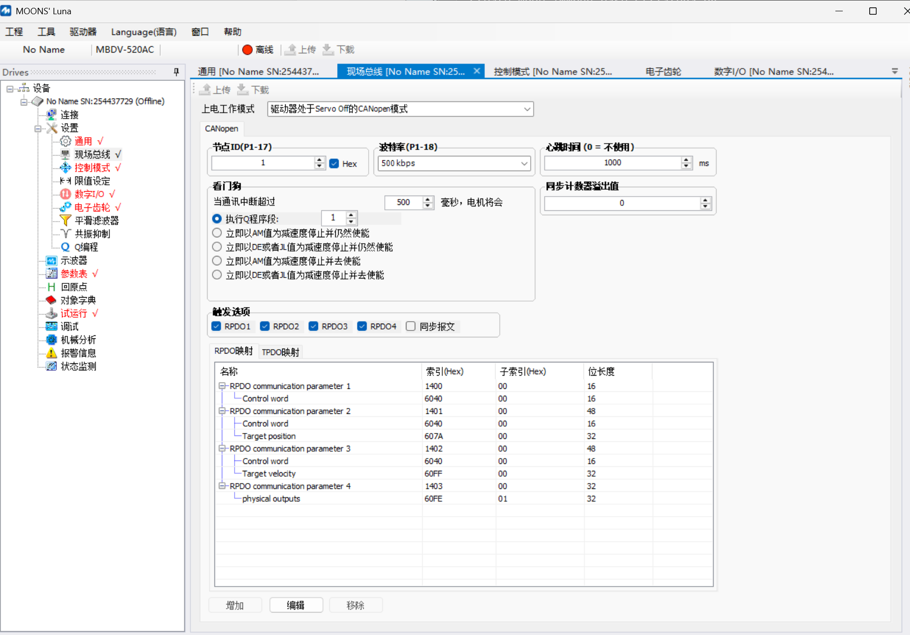

# 配置鸣志电机can通讯
##  配置电机can通讯参数， 
使用usb串口连接到电机上面，打开 luna的can配置工具，如下图所示
 
## 保存参数并重启电机

# 程序控制说明
1. 启动电机并进入预操作状态
2. 使能电机
3. 设置电机速度
4. 读取电机位置
5. 停止电机
## 速度控制说明

### velocity_control_demo.py

这个脚本演示了如何使用CANopen DS402协议控制电机进行速度模式运动控制。主要功能包括：

- **初始化CAN通讯**：连接到CAN总线（can1接口，50kbps波特率）
- **配置DS402状态机**：设置电机节点进入操作使能状态
- **速度模式控制**：使用PROFILED VELOCITY模式，支持加减速斜坡控制
- **实时反馈监控**：通过TPDO读取实际速度和状态字
- **速度序列执行**：执行预定义的速度轨迹（正转、反转、加速、减速、停止）
- **错误处理**：自动检测和清除故障状态

**关键配置参数：**
- 加速度：1000000 (0x6083)
- 减速度：1000000 (0x6084)
- 快速停止减速度：2000000 (0x6085)
- SYNC周期：100ms
- 节点守护周期：10ms 

## 依赖 
- [canopen](https://github.com/canopen-python/canopen) - A Python library for CANopen communication

## CANopen协议说明
https://share.mubu.com/doc/2nHfvmQp91I